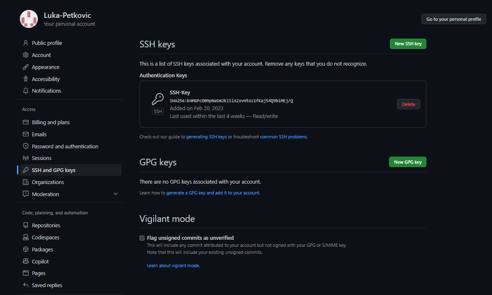

# M300-Services | Toolumgebungeng

GitHub Account
=======

### **SSH-Key erstellen**
Folgende Befehle im Bash ausführen:
1. Account E-Mail von Github eingeben
    ```
    ssh-keygen -t rsa -b 4096 -C "beispiel@beispiel.com"
    ```
2. SSH-Key wird erstellt
    ```
    Generating public/private rsa key pair.
    ```
3. Namensabfrage für den Schlüssel
   ```
   Enter a file in which to save the key (~/.ssh/id_rsa): 
   ```
4. Passwort setzten (Im ideal Fall hinterlegt man das gerade beim SSH-Agent)
    ```
    Enter passphrase (empty for no passphrase): [Passwort]
    Enter same passphrase again: [Passwort wiederholen]
    ``` 

### **SSH-Key dem SSH-Agent hinzufügen**

1. Man muss den Key bei seinem Account unter den Einstellungen hinterlegen:



Git Client
======
### **Client installieren**

Den Git Client braucht man um Dateien auf Github Hoch und runter zuladen. [Git Download](https://git-scm.com/downloads)

### **Client konfigurieren**
1. Zunächst muss man zwei Befehle im Bash eingeben.

```
  git config --global user.name "<username>"
  
  git config --global user.email "<e-mail>"
```
### **Repository klonen**
1. Als nächstes wollen wir ein Repository klonen, dies machen wir im Bash.

```
git clone https://gitlab.com/ch-tbz-it/Stud/m300/
```
2. Damit das funktioniert, muss man ins richtige Verzeichnis wechseln.
```
cd M300
```
3. Damit das Repository aktualisiert wird, muss man zunächst den Folgenden Befehl eingeben.

```
git pull
```

4. Um den Status anzuzeigen, kann man den folgenden Befehl eingeben.

```
git status
```
### **Repository herunterladen & aktualisieren**

1. Zunächst wollen wir ein Ordner im gewünschten Verzeichnis wählen.

```
cd Wohin/auch/immer

mkdir MeinLokalesRepository
```
2. Repository mit SSH klonen

```
git clone git@github.com:<Ihr Name>/my_M300.git
```

3.Jetzt machen wir wieder das gleiche wie bei der letzten Aufgabe. Somit aktualisiert und prüft man den Status.

```
git pull
```

### **Repository hochladen**

1. Zum Verzeichnis wechseln

```
cd Pfad/zu/meinem/Repository
```
2. Die Daten hinzufügen, damit es beim Upload funktioniert

```
git add -A .
```
3. Die Bestätigung geben.

```
git commit -m "Mein Kommentar"
```
4. Upload pushen

```
git push
```


Virtualbox
======

### **Software herunterladen & installieren**

Damit wir fortfahren können, müssen wir VirtualBox herunterladen. 
[VirtualBox download](https://www.virtualbox.org/)

### **ISO-Datei herunterladen**


Damit unsere VM später funktioniert, brauchen wir logischerweise eine ISO, am besten verwendet man gerade diese: [Ubuntu-ISO](https://ubuntu.com/#download)

Damit die ISO-Datei Reproduzierbar ist, muss man es im gewünschten Verzeichnis ablegen. Hierzu muss man achten, dass es auf dem lokalen PC abgespeichert ist.

### **VM erstellen**

Die Schwirigkeit beim erstellen der VM lag bei der Dateigrösse... Ich hatte 10GB laut Anleitung genommen, das hat aber leider nicht funktioniert, da die VM immer wieder abstürzte... Also habe ich mich dazu entschieden 25GB zu nehmen, dannch hat es funktioniert. Wichtig ist ebenfalls dass man das richtige Medium ausgewählt hat. Die ISO Datei muss logischer Weise vorhanden sein.

### **VM einrichten**

Wichtig ist, dass die VM läuft, dannch muss man sich beim Bash anmelden. Paketliste muss nei eingelesen werden und die Pakete Aktualisiert. Dafür braucht man die Befehle:

```
sudo apt-get update   

#Paketlisten des Paketmanagement-Systems "APT" neu einlesen

sudo apt-get upgrade   

#Installierte Pakete wenn möglich auf verbesserte Versionen aktualisieren

sudo reboot           #System-Neustart durchführen
```

### **Synaptic installieren**

1. Synaptic ist zur Verwaltung von Debian-Paketen gemacht, kann aber auch mit RPM-Paketen umgehen. Darum müssen wir das herunterladen.
```
 sudo apt-get install synaptic
```
2. Synaptic öffnen und apache installieren

```
sudo reboot
```

Damit wir testen können, ob das ganze funktoniert hat, muss man prüfen, ob der Standard-Content des Webservers localhost erreichbar ist.

Vagrant
======

Was ist Vagrant eigentlich?

Ein Vagrant-file ist für die Automatisierung oder für die Reproduzierbarkeit. Somit kann man mit einer einfachen ausführung Virtuelle Maschienen erstellen lassen. Man kann nicht nur Virtuelle Maschienen erstellen sondern auch verwalten.


## **Software herunterladen & installieren**

1. Vagrant kann man unter dieser Internetseite herunterladen [Vagrant-Download](https://www.vagrantup.com/)
2. Für die Installation muss man nichts beachten. Wenn man den Download abgeschlossen hat, kann man mit dem Erstellen der Virtuellen Maschienen anfangen.

## **Virtuelle Maschine erstellen**

1. Damit wir ein sogennantes Vagrant-file erstellen können, müssen wir in ein gewünschtes Verzeichnis wechseln und dort einen Ordner erstellen. Nach dem erstellen des Ordners muss man auch gerade dort hin Navigieren.

```
cd Wohin/auch/immer
mkdir MeineVagrantVM
cd MeineVagrantVM
```

2. Vagrantfile erzeugen, VM erstellen und entsprechend starten:

```
vagrant init ubuntu/xenial64        
vagrant up --provider virtualbox    
```

3. Da die VM nun läuft, kann man über ssh zugreifen.

```
vagrant ssh
```

4. VM über GUI ausschalten.

Visual Studio Code
======

### **Software herunterladen & installieren**

1. Damit man eine effiziente Entwicklungsumgebung aufbauen kann, brachut man eine Applikation, welche dafür sorgt, dass man alle lokalen Repositories an einem Ort verwalten kann. Eine Gute Lösung dafür ist Visual Studio code.

2. Mit dem Folgenden Link kann man Visual Studio code herunterladen: [Visual Studio Code Download](https://code.visualstudio.com/)

### **Erweiterungen hinzufügen**
1. Damit das arbeiten leichter fällt, verwenden wir noch vier wichtige Erweiterungen:

* Markdown All in One
* Vagrant Extension
* vscode-pdf Extension
* Auto Markdown TOC
  
Diese erweiterungen kann man bei Visual Studio code an der Linken Seite finden... 


### **Einstellungen anpassen**

1. Damit nicht alle Daten beim Cloud Repository hinzugefügt werden kann man eine sogennante .gitignor datei erstellen.
2. Hierzu ein Screenshot wie die Aussieht:


1. Ich würde euch meine gezeigten Einstellungen empfehlen.

### **Repository hinzufügen & pushen**

1. Damit man die Ganzen Änderungen hochladen kann, muss man an der Linken Seite unter Source Control gehen. Eine Nachricht hinzufügen und dann commit sagen. Nach dem man die Bestätigung gegeben hat und die Daten hochgeladen wurden, muss man noch Synchronisieren.


Automatischer Web-Server | MyVagrant Folder
======
Mit diesem Vagranfile kann automatisch ein Web-Server erstellen ohne etwas gross zu machen. Mann muss nur diesen einen Befehl ausführen:
```
vagrant up
```
Wenn man diesen Befehl eingegeben hat, erstellt er eine Vm "Xenial64" und führt folgende Befehle aus:
```
config.vm.network "forwarded_port", guest:80, host:8080, auto_correct: true #Leitet den Port 80 der VM (Gastsystem) an den Port 8080 des Hostsystems weiter
apt-get update
sudo apt-get install -y apache2
```
Sobald die VM erstellt wurde kann man unter der URL http://localhost:8080 die apache Website öffnen
```
http://localhost:8080
```
Testfälle
======
| Testfall                                           | geschätztes Ergebniss                       | effektives Ergebnis |
| -------------------------------------------------- | ------------------------------------------- | ------------------- |
| 1. Zugang via SSH                                  | Zugriff auf VM möglich                      | korrekt             |
| 2. Zugriff auf die Website                         | Zeigt apache-default-page                   | korrekt             |
| 3. Reproduzierbarkeit                              | VM kann genau gleich wieder erstellt werden | korrekt             |
| 4. VM kann von jemand anderes auch erstellt werden | bei Silvan genau gleich erstellt            | korrekt             |

Wichtige Befehle
======

| Befehl        | Beschreibung                                                    |
|---------------|-----------------------------------------------------------------|
| `git init`    | Erstellt ein neues, leeres Git-Repository im aktuellen Verzeichnis |
| `git add`     | Fügt Änderungen der Arbeitskopie zum Staging-Bereich hinzu        |
| `git commit`  | Speichert die Änderungen im Repository und erstellt eine Version |
| `git clone`   | Erstellt eine lokale Kopie eines Remote-Repositories             |
| `git pull`    | Lädt die neuesten Änderungen aus einem Remote-Repository herunter |
| `git push`    | Überträgt lokale Änderungen an ein Remote-Repository             |
| `git branch`  | Erstellt, löscht oder zeigt Branches im Repository an            |
| `git merge`   | Führt zwei oder mehr Branches zusammen                           |
| `git status`  | Zeigt den Status der Arbeitskopie und des Repositories an        |
| `git log`     | Zeigt die Versionsgeschichte mit allen Commits an                |

[&uarr; nach oben](https://github.com/Luka-Petkovic/M300-Services/tree/main/M300_10-Toolumgebung)


