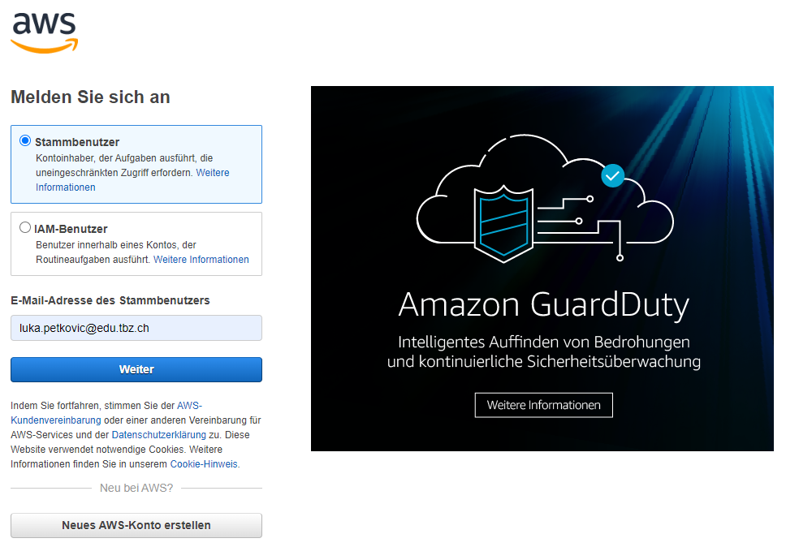
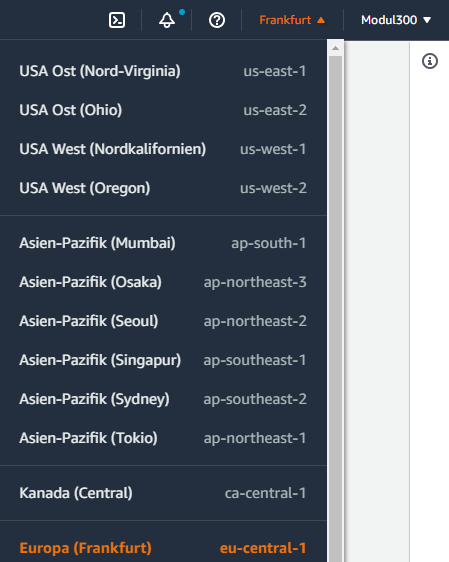
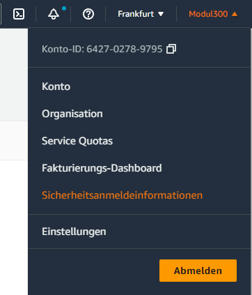
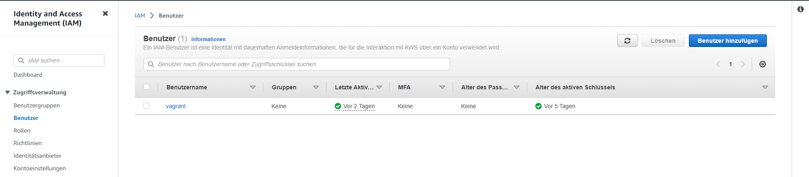
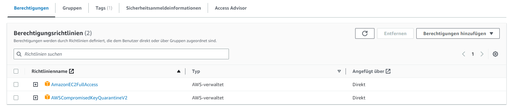
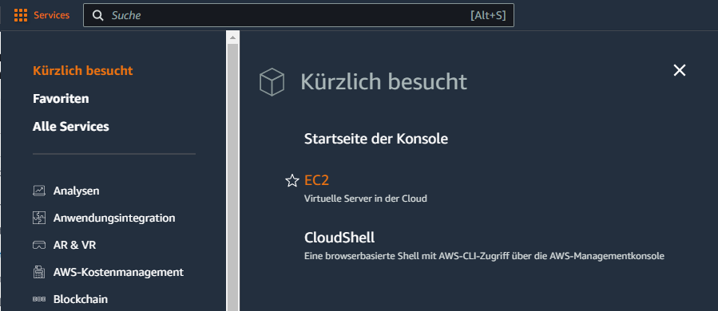
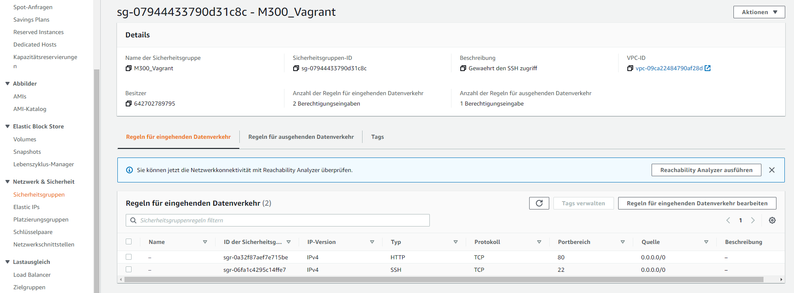
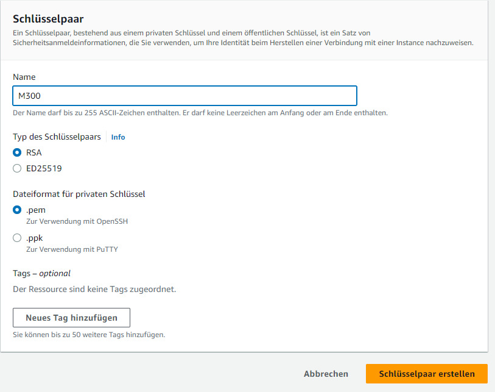
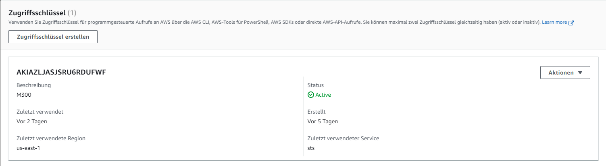
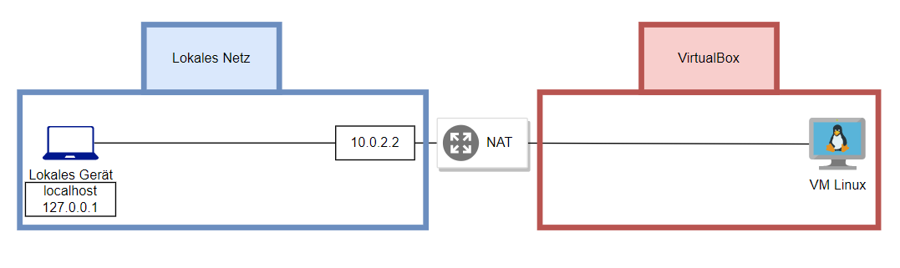

M300 - 20 Infrastruktur-Automatisierung
===

Vagrant
===
1. Zunächst muss ein Verzeichnis für die virtuelle Maschine erstellt werden. In diesem Beispiel wird Ubuntu 2204Server verwendet. Anschließend navigieren Sie in dieses Verzeichnis, entweder in der Powershell oder unter Linux in der Bash.

2. Mithilfe des folgenden Befehls können Sie ein Vagrantfile von der gewünschten Vagrant Box erstellen. Vagrant Boxen sind vordefinierte virtuelle Maschinen. In diesem Fall wird die Vagrant Box "ubuntu/xenial64" verwendet. Sie können diese Box auch in der Vagrant Cloud finden.
```
vagrant init ubuntu/xenial64
```
3. Verwenden Sie "vagrant up", um den Erstellungsprozess zu starten. Die Box oder das Image wird dann aus dem Internet heruntergeladen (falls es noch nicht lokal verfügbar ist) und eine virtuelle Maschine wird erstellt. Dabei werden alle im Vagrantfile festgelegten Konfigurationen berücksichtigt.
```
vagrant up --provider virtualbox
```
Mit dem Parameter "--provider virtualbox" können Sie festlegen, dass Vagrant Virtualbox als Provider verwendet. Vagrant unterstützt auch andere Provider wie beispielsweise Vmware oder Hyper-V.

4. Sobald die virtuelle Maschine erstellt ist, können Sie sich mit dem Befehl "vagrant ssh" auf sie verbinden.
   
```
vagrant ssh
```

5. Hier finden Sie noch die wichtigsten Befehle für Vagrant, einschließlich Anweisungen zum Anhalten oder Löschen der virtuellen Maschine.


| Befehl | Beschreibung |
| ------ | ------------ |
| vagrant up | Startet und provisioniert eine neue virtuelle Maschine |
| vagrant ssh | Verbindet sich per SSH zur laufenden VM |
| vagrant halt | Stoppt die laufende VM |
| vagrant destroy | Löscht die VM und alle zugehörigen Ressourcen |
| vagrant status | Zeigt den Status aller VMs im aktuellen Verzeichnis an |
| vagrant init | Initialisiert ein neues Vagrant-Projekt im Verzeichnis |
| vagrant reload | Neustartet die VM und lädt die Vagrant-Konfiguration |
| vagrant suspend | Pausiert die laufende VM |
| vagrant resume | Nimmt eine pausierte VM wieder auf |
| vagrant provision | Führt eine erneute Provisionierung auf der VM durch |


Packer
===
Schwierigkeiten mit Packer auf windows Systemen

Es kann vorkommen, dass Packer nur mit Linux und macOS-Systemen funktioniert, da es bei der Verwendung von Windows zu Schwierigkeiten bei der Einrichtung der Virtual Machine kommen kann. Dies liegt daran, dass Packer hauptsächlich für Unix-Systeme entwickelt wurde und einige der notwendigen Abhängigkeiten nicht standardmäßig in Windows enthalten sind. Wenn Sie also Packer verwenden möchten, sollten Sie eine Linux- oder macOS-Maschine verwenden, um eine reibungslose Einrichtung und Verwendung sicherzustellen.Deshalb haben wir AWS auf einem MAC Client konfiguriert.

Hier eine kruze Anleitung wie man Packer auf Linux installiert

Aktualisieren Sie Ihr Paket-Repository, um sicherzustellen, dass Sie die neuesten verfügbaren Versionen der Pakete installieren
```
sudo apt-get update
```
Installieren Sie das Paket "unzip", da es von Packer benötigt wird, um Archivdateien zu extrahieren
```
sudo apt-get install unzip
```
Laden Sie die neueste Version von Packer von der offiziellen Website herunter. Sie können den Download-Link auf der Seite https://www.packer.io/downloads finden
```
wget https://www.packer.io/downloads
```
Entpacken Sie das heruntergeladene Packer-Archiv in das Verzeichnis "/usr/local/bin/". Dieses Verzeichnis ist in der Regel bereits in Ihrem PATH enthalten, sodass Sie Packer einfach durch Eingabe des Befehlsnamens verwenden können
```
sudo unzip packer_*_linux_amd64.zip -d /usr/local/bin/
```
Stellen Sie sicher, dass Packer korrekt installiert wurde, indem Sie die Version des installierten Packer-Programms abrufen
```
packer version
```
Wenn alles korrekt installiert wurde, sollte die Ausgabe die installierte Version von Packer anzeigen. Herzlichen Glückwunsch, Sie haben Packer erfolgreich auf Ihrem Linux-System installiert!

Nachdem Packer installiert ist muss man nur im Verzeichnis gehen und die .json Datei ausführen. Nun sollte automatisch eine Linux VM erstellt und konfiguriert werden.
```
Packer build ubuntu-18.04-vagrant.json
```

AWS
===
Schwierigkeiten mit Windows Systemen

Da das Vagrant-Plugin "vagrant-aws" nicht mehr aktiv weiterentwickelt wird und möglicherweise nicht mehr mit den neuesten Versionen von Vagrant und AWS kompatibel ist, kann es auf Windows und Linux zu Problemen bei der Installation und Verwendung des Plugins kommen. Dies kann zu Fehlern bei der Konfiguration oder dem Starten von AWS-Instanzen führen. Aus diesem Grund haben wir uns entschieden, mit MacOS zu arbeiten, da Vagrant auf MacOS besser unterstützt wird und somit möglicherweise reibungsloser funktioniert.

Verbindung mit AWS in Vagrant

Vagrant kann mit verschiedenen Cloud Providern verbunden werden, einschließlich AWS von Amazon. Um AWS mit Vagrant zu nutzen, müssen Sie das vagrant-aws Plugin installieren und die dummy Box lokal hinzufügen:

ruby
```
vagrant plugin install vagrant-aws
```

```
$ vagrant box add dummy https://github.com/mitchellh/vagrant-aws/raw/master/dummy.box
```
### **AWS vorbereiten**

Folgen Sie diesen Schritten, um AWS für Vagrant vorzubereiten:

1. Öffnen Sie die [AWS-Website](https://aws.amazon.com/de/) und erstellen Sie einen Amazon-Stammbenutzer, falls noch nicht vorhanden.


    
2. Ändern Sie den Rechenzentrum-Standort auf Frankfurt, um die schnellste Verbindung zu erhalten. Beachten Sie jedoch, dass sich dieser je nach Bedarf ändern kann.



3. Erstellen Sie einen AWS-Benutzer, auf den Vagrant auf "EC2" zugreifen kann.



4. Klicken Sie oben rechts auf Ihren Benutzernamen und dann auf "Sicherheitsanmeldeinformationen".



5. Klicken Sie auf "Benutzer" und erstellen Sie einen neuen Benutzer mit dem Namen "vagrant".



6. Weisen Sie diesem Benutzer die "Berechtigungsrichtlinie" "AmazonEC2FullAccess" zu.


    
7. Überprüfen Sie erneut, ob "Frankfurt" als Rechenzentrum ausgewählt ist.


        
8.  Erstellen Sie eine Sicherheitsgruppe, die Datenverkehr über Port 22 und Port 80 an die VM zulässt.


        
9. Erstellen Sie ein Schlüsselpaar und speichern Sie die .pem-Datei im Hauptverzeichnis des Vagrant-Projekts.
Wählen Sie "RSA" und ".pem" und laden Sie die Datei mit dem privaten Schlüssel herunter.
Achten Sie darauf, den Schlüssel nicht auf Github hochzuladen.



### **Konfiguration des Vagrantfiles**

Bearbeiten Sie das Vagrantfile und geben Sie die Zugriffsschlüssel, das .pem-Zertifikat und weitere Angaben zum Rechenzentrum-Standort und zum Instanztyp an:

ruby

```
Vagrant.configure("2") do |config|
    config.vm.box = "dummy"
  
    config.vm.provider :aws do |aws, override|
      aws.access_key_id = ""
      aws.secret_access_key = ""
      #aws.session_token = "SESSION TOKEN"
      aws.keypair_name = "vagrant"
      aws.region = "eu-central-1"
      aws.ami = "ami-0d1ddd83282187d18"
      aws.instance_type = "t2.micro"
      aws.security_groups = "vagrant"
      override.ssh.username = "ubuntu"
      override.ssh.private_key_path = "vagrant.pem"
    end
    config.vm.synced_folder "html/", "/var/www/html"
    config.vm.provision "shell", path: "scripts/apache.sh"
  end
```

Netzwerkplan
===

