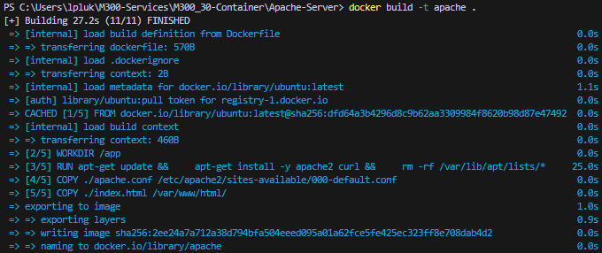
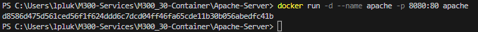
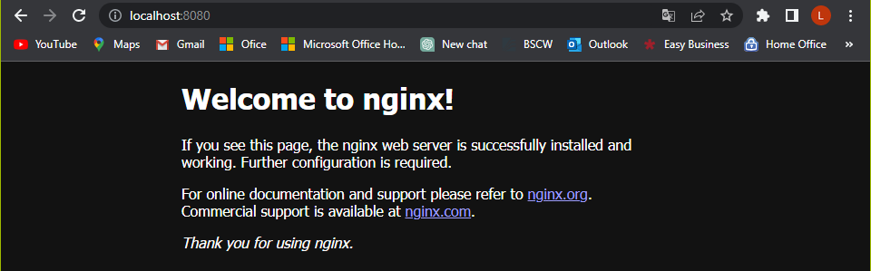

### **Erstelle ein Image**
```
docker build -t mein-image .
```

Nachdem ausführen des Befehls sollte das so aussehen:


### **Erstelle ein Container**
```
docker run -d --name mein-container -p 8080:80 mein-image
```

Nachdem ausführen des Befehls sollte das so aussehen:


### **Wichtig!**
Die drei Dateien müssen sich im selben Verzeichnis befinden und der Benutzer muss im selben Verzeichnis sein, um die Befehle erfolgreich auszuführen.

Schlussendlich sollte man unter http://localhost:8080 das hier sehen:
