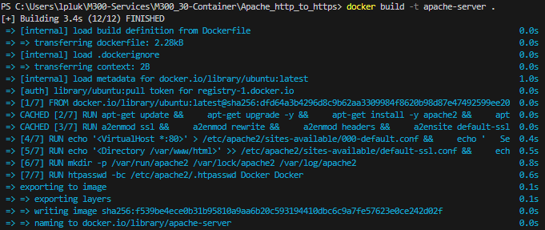
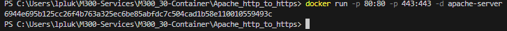
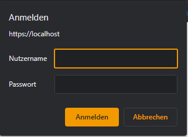
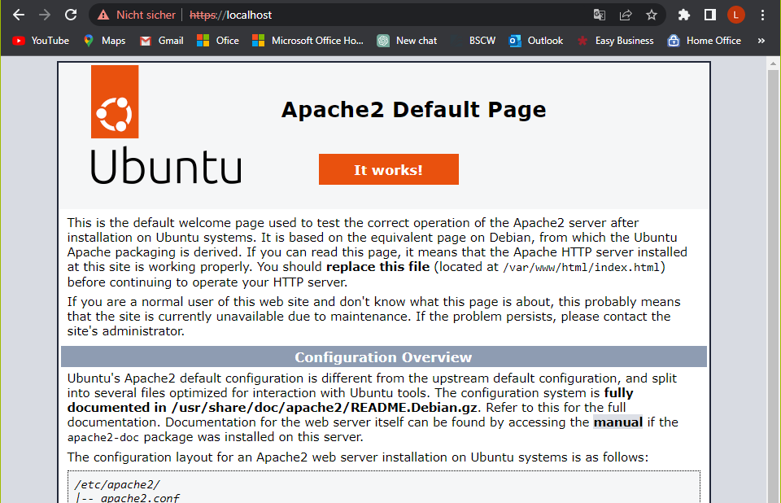

### **Erstelle ein Image**
```
docker build -t <image-name> .
```



### **Erstelle ein Container**
```
docker run -p 80:80 -p 443:443 -d <image-name>
```

Nachdem ausführen des Befehls sollte das so aussehen:


Beim aufrufen der Seite http://localhost sollte man direkt auf https:// geleitet werden und nach User gefragt werden:

