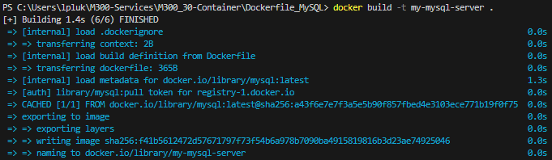
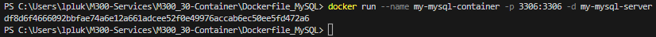
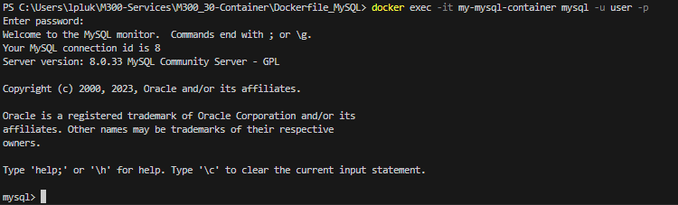

### **Erstelle ein Image**
```
docker build -t my-mysql-server .
```

Nachdem ausführen des Befehls sollte das so aussehen:


### **Erstelle ein Container**
```
docker run --name my-mysql-container -p 3306:3306 -d my-mysql-server
```

Nachdem ausführen des Befehls sollte das so aussehen:


Schlussendlich sollte man unter Docker das hier sehen:


Man kann ebenfalls den unten erwähnten Befehl benutzten um sich auf dem Container wie MySQL zu verbinden:
```
docker exec -it my-mysql-container mysql -u user -p
```
Man wird um sein Passwort gefragt in meinem Dockerfile handelt sich um das Passwort "123456". Nachdem eingeben des Passworts sollte man das hier sehen:
