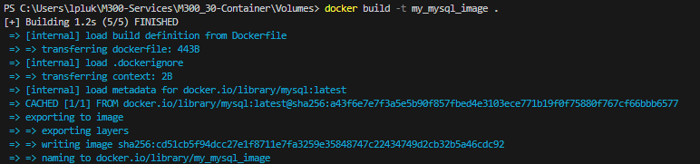
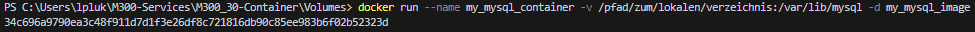
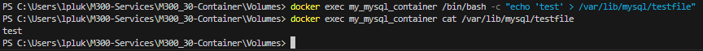

### **Erstelle ein Image**
```
docker build -t my_mysql_image .
```

Nachdem ausführen des Befehls sollte das so aussehen:


### **Erstelle des MySQL Container**
```
docker run --name my_mysql_container -v /pfad/zum/lokalen/verzeichnis:/var/lib/mysql -d my_mysql_image
```

Nachdem ausführen des Befehls sollte das so aussehen:


### **Testen ob man sich mit dem Volume verbinden kann**
Um unser neu erstelltes Volume zu testen kann man ganz einfach eine Datei im Volume erstellen und diese dan mit dem "cat" Befehl hollen.

Hier ist der Befehl um die Datei in der Volume zu ertsellen:
```
docker exec my_mysql_container /bin/bash -c "echo 'test' > /var/lib/mysql/testfile"
```

Und mit diesem "cat" Befehl kannst du den Inhalt der Datei anschauen:
```
docker exec my_mysql_container cat /var/lib/mysql/testfile
```

Schlussendlich sollte das ganze etwa so aussehen:
