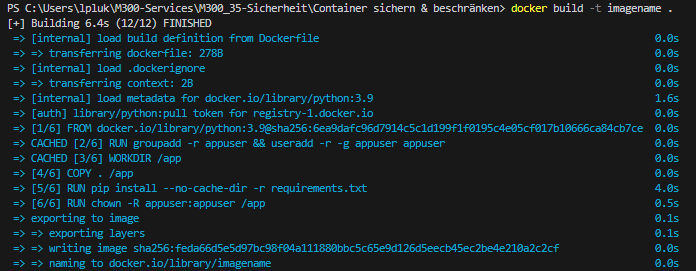
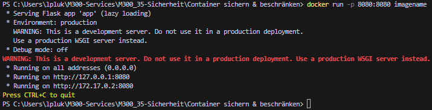

### **Erstelle ein Image**
```
docker build -t imagename .
```

Nachdem ausführen des Befehls sollte das so aussehen:


### **Erstelle ein Container**
```
docker run -p 8080:8080 imagename
```

Nachdem ausführen des Befehls sollte das so aussehen:


Schlussendlich sollte man unter http://localhost:8080 das hier sehen:
