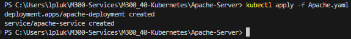
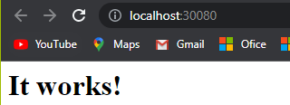

### **Erstelle Kubernetes Apache-Server**
```
kubectl apply -f Apache.yaml
```

### **Lösche denn erstellten Apache-Server**
```
kubectl delete -f Apache.yaml
```

### **Info**
Nachdem ausführen des Befehls "kubectl apply -f Apache.yaml" kann man automatisch nach einigen Sekunden auf http://localhost:30080 zugreifen

So sollte es aussehen nachdem ausführen von "kubectl apply -f Apache.yaml":


Unter http://localhost:30080 findet man nun dies
