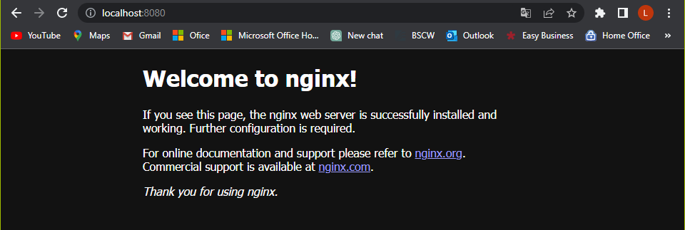

### **Erstelle Kubernetes Apache-Server**
```
kubectl apply -f Cluster.yaml
```

So sollte es aussehen nachdem ausführen von "kubectl apply -f Apache.yaml":


### **Lösche denn erstellten Apache-Server**
```
kubectl delete -f Cluster.yaml
```

### **Port-Forward um den Cluster zu testen**
```
kubectl port-forward service/master-service 8080:80  
kubectl port-forward service/worker-service 8081:80   
```

So sollte es aussehen wen man http://localhost:8080 aufruft:


So sollte es aussehen wen man http://localhost:8081 aufruft:


### **Info**
Nachdem erstellen des Clusters und dem Port-Forward können die Worker unter dem Link http://localhost:8081 abgerufen werden und der Master unter http://localhost:8080
