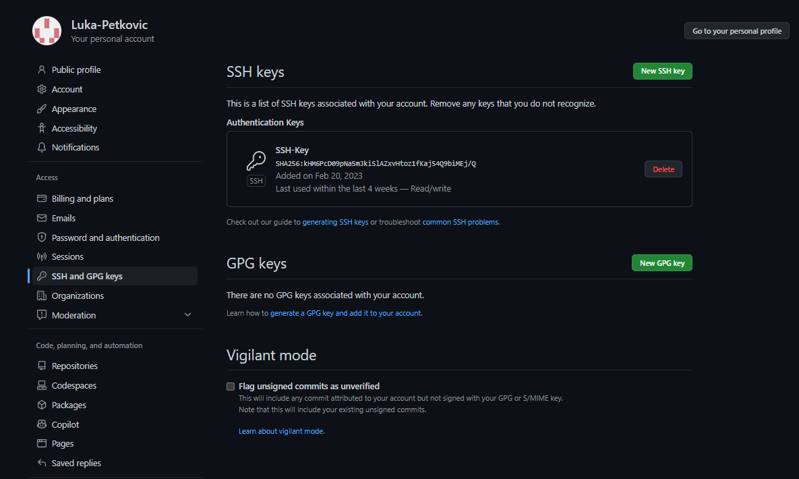

# M300-Services | Toolumgebungeng

M300-Services - 10-25
===

GitHub Account
=======

### **SSH-Key erstellen**
Folgende Befehle im Bash ausführen:
1. Account E-Mail von Github eingeben
    ```
    ssh-keygen -t rsa -b 4096 -C "beispiel@beispiel.com"
    ```
2. SSH-Key wird erstellt
    ```
    Generating public/private rsa key pair.
    ```
3. Namensabfrage für den Schlüssel
   ```
   Enter a file in which to save the key (~/.ssh/id_rsa): 
   ```
4. Passwort setzten (Im ideal Fall hinterlegt man das gerade beim SSH-Agent)
    ```
    Enter passphrase (empty for no passphrase): [Passwort]
    Enter same passphrase again: [Passwort wiederholen]
    ``` 

### **SSH-Key dem SSH-Agent hinzufügen**

1. Man muss den Key bei seinem Account unter den Einstellungen hinterlegen:



[&uarr; nach oben](https://github.com/Luka-Petkovic/M300-Services)

Git Client
======
### **Client installieren**

Den Git Client braucht man um Dateien auf Github Hoch und runter zuladen. [Git Download](https://git-scm.com/downloads)

### **Client konfigurieren**
1. Zunächst muss man zwei Befehle im Bash eingeben.

```
  git config --global user.name "<username>"
  
  git config --global user.email "<e-mail>"
```
### **Repository klonen**
1. Als nächstes wollen wir ein Repository klonen, dies machen wir im Bash.

```
git clone https://gitlab.com/ch-tbz-it/Stud/m300/
```
2. Damit das funktioniert, muss man ins richtige Verzeichnis wechseln.
```
cd M300
```
3. Damit das Repository aktualisiert wird, muss man zunächst den Folgenden Befehl eingeben.

```
git pull
```

4. Um den Status anzuzeigen, kann man den folgenden Befehl eingeben.

```
git status
```
### **Repository herunterladen & aktualisieren**

1. Zunächst wollen wir ein Ordner im gewünschten Verzeichnis wählen.

```
cd Wohin/auch/immer

mkdir MeinLokalesRepository
```
2. Repository mit SSH klonen

```
git clone git@github.com:<Ihr Name>/my_M300.git
```

3.Jetzt machen wir wieder das gleiche wie bei der letzten Aufgabe. Somit aktualisiert und prüft man den Status.

```
git pull
```

### **Repository hochladen**

1. Zum Verzeichnis wechseln

```
cd Pfad/zu/meinem/Repository
```
2. Die Daten hinzufügen, damit es beim Upload funktioniert

```
git add -A .
```
3. Die Bestätigung geben.

```
git commit -m "Mein Kommentar"
```
4. Upload pushen

```
git push
```
[&uarr; nach oben](https://github.com/Luka-Petkovic/M300-Services)

Virtualbox
======

### **Software herunterladen & installieren**

Damit wir fortfahren können, müssen wir VirtualBox herunterladen. 
[VirtualBox download](https://www.virtualbox.org/)

### **ISO-Datei herunterladen**


Damit unsere VM später funktioniert, brauchen wir logischerweise eine ISO, am besten verwendet man gerade diese: [Ubuntu-ISO](https://ubuntu.com/#download)

Damit die ISO-Datei Reproduzierbar ist, muss man es im gewünschten Verzeichnis ablegen. Hierzu muss man achten, dass es auf dem lokalen PC abgespeichert ist.

### **VM erstellen**

Die Schwirigkeit beim erstellen der VM lag bei der Dateigrösse... Ich hatte 10GB laut Anleitung genommen, das hat aber leider nicht funktioniert, da die VM immer wieder abstürzte... Also habe ich mich dazu entschieden 25GB zu nehmen, dannch hat es funktioniert. Wichtig ist ebenfalls dass man das richtige Medium ausgewählt hat. Die ISO Datei muss logischer Weise vorhanden sein.

### **VM einrichten**

Wichtig ist, dass die VM läuft, dannch muss man sich beim Bash anmelden. Paketliste muss nei eingelesen werden und die Pakete Aktualisiert. Dafür braucht man die Befehle:

```
sudo apt-get update   

#Paketlisten des Paketmanagement-Systems "APT" neu einlesen

sudo apt-get upgrade   

#Installierte Pakete wenn möglich auf verbesserte Versionen aktualisieren

sudo reboot           #System-Neustart durchführen
```

### **Synaptic installieren**

1. Synaptic ist zur Verwaltung von Debian-Paketen gemacht, kann aber auch mit RPM-Paketen umgehen. Darum müssen wir das herunterladen.
```
 sudo apt-get install synaptic
```
2. Synaptic öffnen und apache installieren

```
sudo reboot
```

Damit wir testen können, ob das ganze funktoniert hat, muss man prüfen, ob der Standard-Content des Webservers localhost erreichbar ist.

[&uarr; nach oben](https://github.com/Luka-Petkovic/M300-Services)

Vagrant
======

Was ist Vagrant eigentlich?

Ein Vagrant-file ist für die Automatisierung oder für die Reproduzierbarkeit. Somit kann man mit einer einfachen ausführung Virtuelle Maschienen erstellen lassen. Man kann nicht nur Virtuelle Maschienen erstellen sondern auch verwalten.


## **Software herunterladen & installieren**

1. Vagrant kann man unter dieser Internetseite herunterladen [Vagrant-Download](https://www.vagrantup.com/)
2. Für die Installation muss man nichts beachten. Wenn man den Download abgeschlossen hat, kann man mit dem Erstellen der Virtuellen Maschienen anfangen.

## **Virtuelle Maschine erstellen**

1. Damit wir ein sogennantes Vagrant-file erstellen können, müssen wir in ein gewünschtes Verzeichnis wechseln und dort einen Ordner erstellen. Nach dem erstellen des Ordners muss man auch gerade dort hin Navigieren.

```
cd Wohin/auch/immer
mkdir MeineVagrantVM
cd MeineVagrantVM
```

2. Vagrantfile erzeugen, VM erstellen und entsprechend starten:

```
vagrant init ubuntu/xenial64        
vagrant up --provider virtualbox    
```

3. Da die VM nun läuft, kann man über ssh zugreifen.

```
vagrant ssh
```

4. VM über GUI ausschalten.

[&uarr; nach oben](https://github.com/Luka-Petkovic/M300-Services)

Visual Studio Code
======

### **Software herunterladen & installieren**

1. Damit man eine effiziente Entwicklungsumgebung aufbauen kann, brachut man eine Applikation, welche dafür sorgt, dass man alle lokalen Repositories an einem Ort verwalten kann. Eine Gute Lösung dafür ist Visual Studio code.

2. Mit dem Folgenden Link kann man Visual Studio code herunterladen: [Visual Studio Code Download](https://code.visualstudio.com/)

### **Erweiterungen hinzufügen**
1. Damit das arbeiten leichter fällt, verwenden wir noch vier wichtige Erweiterungen:

* Markdown All in One
* Vagrant Extension
* vscode-pdf Extension
* Auto Markdown TOC
  
Diese erweiterungen kann man bei Visual Studio code an der Linken Seite finden... 


### **Einstellungen anpassen**

1. Damit nicht alle Daten beim Cloud Repository hinzugefügt werden kann man eine sogennante .gitignor datei erstellen.
2. Hierzu ein Screenshot wie die Aussieht:


1. Ich würde euch meine gezeigten Einstellungen empfehlen.

### **Repository hinzufügen & pushen**

1. Damit man die Ganzen Änderungen hochladen kann, muss man an der Linken Seite unter Source Control gehen. Eine Nachricht hinzufügen und dann commit sagen. Nach dem man die Bestätigung gegeben hat und die Daten hochgeladen wurden, muss man noch Synchronisieren.


[&uarr; nach oben](https://github.com/Luka-Petkovic/M300-Services)

Automatischer Web-Server | MyVagrant Folder
======
Navigieren sie im Folder "M300_10-Toolumgebung/MyVagrant" dort sollten sie ein Vagrantfile finden.
 
Mit diesem Vagranfile kann automatisch ein Web-Server erstellen ohne etwas gross zu machen. Mann muss nur diesen einen Befehl ausführen:
```
vagrant up
```
Wenn man diesen Befehl eingegeben hat, erstellt er eine Vm "Xenial64" und führt folgende Befehle aus:
```
config.vm.network "forwarded_port", guest:80, host:8080, auto_correct: true #Leitet den Port 80 der VM (Gastsystem) an den Port 8080 des Hostsystems weiter
apt-get update
sudo apt-get install -y apache2
```
Sobald die VM erstellt wurde kann man unter der URL http://localhost:8080 die apache Website öffnen
```
http://localhost:8080
```

[&uarr; nach oben](https://github.com/Luka-Petkovic/M300-Services)

Testfälle
======
| Testfall                                           | geschätztes Ergebniss                       | effektives Ergebnis |
| -------------------------------------------------- | ------------------------------------------- | ------------------- |
| 1. Zugang via SSH                                  | Zugriff auf VM möglich                      | korrekt             |
| 2. Zugriff auf die Website                         | Zeigt apache-default-page                   | korrekt             |
| 3. Reproduzierbarkeit                              | VM kann genau gleich wieder erstellt werden | korrekt             |
| 4. VM kann von jemand anderes auch erstellt werden | bei Silvan genau gleich erstellt            | korrekt             |

Wichtige Befehle
======

| Befehl        | Beschreibung                                                    |
|---------------|-----------------------------------------------------------------|
| `git init`    | Erstellt ein neues, leeres Git-Repository im aktuellen Verzeichnis |
| `git add`     | Fügt Änderungen der Arbeitskopie zum Staging-Bereich hinzu        |
| `git commit`  | Speichert die Änderungen im Repository und erstellt eine Version |
| `git clone`   | Erstellt eine lokale Kopie eines Remote-Repositories             |
| `git pull`    | Lädt die neuesten Änderungen aus einem Remote-Repository herunter |
| `git push`    | Überträgt lokale Änderungen an ein Remote-Repository             |
| `git branch`  | Erstellt, löscht oder zeigt Branches im Repository an            |
| `git merge`   | Führt zwei oder mehr Branches zusammen                           |
| `git status`  | Zeigt den Status der Arbeitskopie und des Repositories an        |
| `git log`     | Zeigt die Versionsgeschichte mit allen Commits an                |

[&uarr; nach oben](https://github.com/Luka-Petkovic/M300-Services)

M300 - 30 Container
===

Container
===

Ein Container ist ein Konzept der Informatik, das hilfreich ist, um Anwendungen in einer Umgebung auszuführen, die isoliert und unabhängig von anderen Anwendungen und dem Betriebssystem des Computers ist.

Ein Vorteil von Containern ist, dass sie portabel sind und auf verschiedenen Betriebssystemen und Servern ausgeführt werden können, solange sie die Container-Software unterstützen. Durch die Verwendung von Containern können Anwendungen schneller bereitgestellt und skaliert werden, da sie unabhängig von der zugrunde liegenden Infrastruktur sind und somit schneller und einfacher bereitgestellt werden können.

[&uarr; nach oben](https://github.com/Luka-Petkovic/M300-Services)

Docker
===

## Wichtige Befehle für Docker ##

| Befehl | Beschreibung |
| --- | --- |
| `docker build` | Baut ein Docker-Image aus einem Dockerfile |
| `docker run` | Startet einen Docker-Container aus einem Docker-Image |
| `docker stop` | Stoppt einen laufenden Docker-Container |
| `docker rm` | Löscht einen Docker-Container |
| `docker rmi` | Löscht ein Docker-Image |
| `docker ps` | Zeigt eine Liste der laufenden Docker-Container an |
| `docker images` | Zeigt eine Liste der verfügbaren Docker-Images an |
| `docker exec` | Führt einen Befehl in einem laufenden Docker-Container aus |
| `docker-compose up` | Startet Docker-Container mit Docker Compose |
| `docker-compose down` | Stoppt Docker-Container mit Docker Compose und löscht sie |
| `docker save` | Speichert ein Docker-Image als Tar-Datei |
| `docker load` | Lädt ein Docker-Image aus einer Tar-Datei |
| `docker login` | Meldet sich bei Docker Hub oder einer anderen Docker-Registry an |
| `docker push` | Lädt ein Docker-Image auf Docker Hub oder eine andere Docker-Registry hoch |
| `docker pull` | Lädt ein Docker-Image von Docker Hub oder einer anderen Docker-Registry herunter |

# Installation Docker Desktop und Aktivierung von WSL2 #

1. Laden Sie Docker Desktop für Windows herunter. 

Dazu kann man direk auf diese Webseite gehen. [Docker-Desktop](https://www.docker.com/products/docker-desktop/)

2. Führen Sie den Installationsassistenten aus. 

Öffnen Sie die heruntergeladene Datei "DockerDesktopInstaller.exe" und folgen Sie den Anweisungen des Installationsassistenten.

3. Konfigurieren Sie Docker Desktop. 

Nach Abschluss der Installation startet Docker Desktop automatisch. Möglicherweise müssen Sie jedoch den Computer neu starten, um Docker Desktop ordnungsgemäß zu starten. In den Einstellungen sollten man die Option "Use the WSL 2 based engine" auswählen. Wenn Sie dies tun, wird Docker Desktop WSL2 als Engine verwenden.

4. Aktivieren Sie WSL2.

Öffne Docker Desktop und gehen sie auf das Zahnrad. Unter "General" kann man nun WSL2 Aktivieren:


1. Installieren Sie eine Linux-Distribution.

Da Docker Desktop WSL2 als Engine verwendet, benötigen Sie eine Linux-Distribution, die auf Ihrem Computer ausgeführt werden kann. Ich empfehle Ubuntu 22.04.2 LTS:


6. Überprüfen Sie die Installation.

Öffnen Sie ein PowerShell-Fenster und führen Sie den folgenden Befehl aus, um zu überprüfen, ob Docker Desktop ordnungsgemäß installiert und konfiguriert ist:
```
docker run hello-world
```
Wenn alles funktioniert hat, sollte es folgendermassen aussehen:


Somit hat man Docker Desktop erfolgreich auf Windows installiert und WSL2 aktiviert.

[&uarr; nach oben](https://github.com/Luka-Petkovic/M300-Services)

Docker Architecktur
===


## Docker Deamon ## 

* Erstellen, Ausführen und Überwachen der Container

* Bauen und Speichern von Images

## Docker Client ##

* Docker wird über die Kommandozeile (CLI) mittels des Docker Clients bedient

* Kommuniziert per HTTP REST mit dem Docker Daemon

## Images ##

* Images sind gebuildete Umgebungen welche als Container gestartet werden können

* Images sind nicht veränderbar, sondern können nur neu gebuildet werden.

## Container ## 

* Container sind die ausgeführten Images.

* Ein Image kann beliebig oft als Container ausgeführt werden.
  

## Docker Registry ## 

* In Docker Registries werden Images abgelegt und verteilt.

[&uarr; nach oben](https://github.com/Luka-Petkovic/M300-Services)

Dockerfile
===

Ein Dockerfile ist ein Textdokument, das eine Abfolge von Anweisungen enthält, mit denen ein Docker-Image erstellt werden kann. Um ein Dockerfile zu erstellen, kann man zuerst ein neues Verzeichnis anlegen und darin eine Datei mit dem Namen "Dockerfile" erstellen.

Anschliessend kann das Image wie folgt gebuildet werden:
```
    $ docker build -t mysql .
```
Starten:
```
    $ docker run --rm -d --name mysql mysql
```
Funktionsfähigkeit überprüfen:
```
    $ docker exec -it mysql bash
```
Überprüfung im Container:
```
    $ ps -ef
    $ netstat -tulpen
```

[&uarr; nach oben](https://github.com/Luka-Petkovic/M300-Services)

Netzwerk-Anbindung
===

Das wichtigste bei den Netzwerk Anbindungen ist, dass man weiss wie man Aussenstehenden Personen zugriff gebenkann. Das ganze funktioniert mit Ports. Dafür braucht man folgenden Behfel: -p oder -P.

Um eine Verbindung zu einem Docker-Container herzustellen, der eine Anwendung ausführt, die auf einen bestimmten Port hört, muss der Port an den Host oder das Netzwerk weitergeleitet werden. Dazu kann man im Dockerfile die Ports, die die Anwendung nutzt, über die Anweisung "EXPOSE" eintragen. Dies ermöglicht es, dass andere Container oder Anwendungen über das Netzwerk auf den Container zugreifen und mit der Anwendung kommunizieren können.

[&uarr; nach oben](https://github.com/Luka-Petkovic/M300-Services)

Volumes
===

Bisher gingen alle Änderungen im Dateisystem verloren, wenn der Docker-Container gelöscht wurde. Um Daten auch über das Löschen des Containers hinaus zu erhalten, bietet Docker verschiedene Optionen:

* Daten auf dem Host ablegen: Man kann die Daten auf dem Hostsystem speichern, auf dem Docker läuft. Dadurch bleiben die Daten auch erhalten, wenn der Container gelöscht wird.

* Daten zwischen Containern teilen: Man kann Daten zwischen verschiedenen Containern teilen. Dadurch können mehrere Container auf dieselben Daten zugreifen und die Daten bleiben erhalten, auch wenn einer der Container gelöscht wird.

* Eigene Volumes erstellen: Man kann eigene Volumes erstellen, um Daten zu speichern. Diese Volumes sind unabhängig vom Container und können auch von anderen Containern genutzt werden. Dadurch bleiben die Daten erhalten, auch wenn der Container gelöscht wird.

Diese Optionen erlauben es, Daten auch über das Löschen eines Containers hinaus zu behalten und erleichtern die Verwaltung von Daten in Docker-Containern.

## Volume - Verzeichnis ##

Ein Volume ist ein spezielles Verzeichnis auf dem Hostsystem, in dem ein oder mehrere Docker-Container ihre Daten speichern können. Volumes bieten verschiedene nützliche Funktionen für die Verwaltung von persistenter oder gemeinsam genutzter Daten.

## Wie erstellt man ein neues Volume /data Verzeichnis? ##

Man muss den Folgenden Befehl einggeben, dass ein neues Docker Volume angelegt wird.

```
docker volume create data
```

Mit dem Folgenden Befehl kann man Überprüfen, ob der Befehl funktioniert hat. Somit werden alle verfügbaren Docker-Volumes aufgelistet.
```
docker volume ls
```

Damit man das Volume verwenden kann, muss man die folgenden Zeilen im Docker-Compose hinzufügen. Smoit wird "my-data" durch den gewünschten Namen des Volumes ersetzt.
```
volumes:
  my-data:
```

## Datencontainer ##

Wie starten man einen Container? Und wie kommen andere Personen darauf?

Um den Container zu starten, muss man den folgenden Befehl eingeben:
```
docker run
```
Um auf ein Container zugreifen zukönnen, muss man folgenden Behfel eingeben:
```
--volumes-from
```

## Named Volumes ##

Docker Volume ist seit Version 1.9 ein wichtiger Befehl, zur Verwaltung von Volumes auf einem Docker Host. Mit dem Befehl kann man ganz viele Sachen verwalten. Alle diese hier aufzuzählen macht aber keinen Sinn.

[&uarr; nach oben](https://github.com/Luka-Petkovic/M300-Services)

Image-Bereitstellung
===

Es existieren zahlreiche Optionen, um Images bereitzustellen. Man kann sie durch das Erstellen von Dockerfiles erstellen, von einer Registry mit "docker pull" herunterladen oder mithilfe von "docker load" aus einer Archivdatei installieren.

## Namensgebung für Images ##

Images bestehen aus einem Namen und einer Version, wobei bei fehlender Angabe automatisch ":latest" hinzugefügt wird. Um Images bereitzustellen, sind präzise und beschreibende Namen und Tags von entscheidender Bedeutung. Die Namen und Tags werden entweder beim Bauen der Images oder durch den Befehl "docker tag" festgelegt.

Bei den Tag-Namen muss man auf ein Paar Sachen achten:

* Gross- und Kleinbuchstaben
* Zahlen
* Symbolen . und -
* nicht länger als 128 Zeichen
* erstes Zeichen kein . oder -

Bei der Entwicklung eines Workflows ist es äußerst wichtig, sinnvolle Namen für Repositories und Tags zu verwenden. Docker hat nur wenige Einschränkungen bezüglich der Namensgebung und erlaubt jederzeit die Erstellung oder Löschung von Namen. Es obliegt also dem Entwicklungsteam, ein angemessenes Namensschema zu entwerfen und anzuwenden

## Warnung vor dem latest-Tag ##

Wenn bei einem "docker run" oder "docker pull" Befehl kein spezifischer Tag angegeben wird, verwendet Docker standardmäßig das Image, das mit "latest" gekennzeichnet ist. Wenn kein solches Image vorhanden ist, wird eine Fehlermeldung ausgegeben.

# Docker Hub #

Ein eigenes Images bereitzustellen ist am einfachsten, wenn man Dockers Hub verwendet.

Das Hub ist soweit kostenlos, man kann aber auch für Repositories von privaten Personen zahlen.

## Docker Hub einrichten ##

1. Zuerst muss man achten, dass man einen Docker Hub Account hat.
2. Image erstellen

```
docker tag mysql username/mysql
```

3. Um das Image hochzuladen, muss man den Befehl push mit verwenden.

```
docker push username/mysql
```

Dannach muss das Image noch beschrieben werden.

## Weitere Befehle ##

Nach einem Image kann man suchen mit folgendem Befehl:

```
docker search mysql
```
Um ein Image herunterzuladen, muss man den befehl pull verwenden:

```
docker pull ubuntu
```

# Export/Import von Container und Images #

Damit man Images zwischen zwei Hots hin und her verschieben kann, braucht man die Befehle docker export und docker import. Damit man Verzeichnisse hin und her kopieren kann, verwenden wir docker save und docker load.
```
docker export
```

```
docker import
```


Um seine eigenen Images sehen zu können, muss man folgenden Befehl ausführen:

```
/vagrant/mysql$ docker images
```
Wie kann ich mein Images wiederherstellen?

```
docker load
```


## TAR-Format ##

Das TAR-Format dient der Archivierung und Komprimierung von Dateien und Verzeichnissen und hat seinen Ursprung in der Sicherung von Daten auf Magnetbändern. Heutzutage wird es oft verwendet, um Dateien in einer einzelnen, komprimierten Datei für die Übertragung oder Speicherung zu archivieren. Um die Dateigröße weiter zu reduzieren, können TAR-Dateien mit verschiedenen Komprimierungsverfahren wie Gzip, bzip2 oder XZ komprimiert werden. Im Bereich von Docker-Images werden TAR-Dateien häufig als Archivdateien verwendet.

# Private Registry #

Es gibt verschiedene Möglichkeiten, Images neben dem Docker Hub bereitzustellen, aber die manuelle Erstellung oder der Export/Import von Images sind suboptimale Optionen. Das Erstellen von Images aus Dockerfiles auf jedem Host ist langsam und kann zu unterschiedlichen Images führen, während das Exportieren und Importieren von Images knifflig und fehleranfällig sein kann. Stattdessen wird empfohlen, eine andere Registry zu verwenden, die selbst gehostet oder von einem anderen Unternehmen betrieben wird.

[&uarr; nach oben](https://github.com/Luka-Petkovic/M300-Services)

M300 - 35 Container-Sicherheit
=== 

Protokollieren & Überwachen
===

In der Informatik ist die Sicherheit immer an der ersten Stelle. Darum sollte man ebenfalls bei den Container auf die Sicherheit achten. Bei Komplexen Systemen zb. (Wenn mehrere Container mit eineinander verbunden sind.)  ist es natürlich noch wichtiger, dass die Systeme reibbungslos laufen. 

Für die Sicherheit der Container ist das protokollieren einer der Wichtigsten Punkten. Wenn man keine Logging-Software angegeben hat, protokolliert Docker nur das was an STDOUT STDERR geschickt wird.

Wenn du eine Anwendung in einem Docker-Container startest, kannst du das Verhalten der Anwendung überwachen, indem du die Ausgabe auf die Standardausgabe (STDOUT) oder die Standardfehlerausgabe (STDERR) sendest. STDOUT und STDERR sind Kanäle, über die Anwendungen mit der Umgebung kommunizieren. STDOUT wird normalerweise für die normale Ausgabe von Anwendungen verwendet, während STDERR für Fehlermeldungen und Warnungen verwendet wird.

Docker protokolliert standardmäßig alles, was an STDOUT oder STDERR geschickt wird, und speichert die Ausgabe in einem Container-Log-File. Dieses Log-File kann dann verwendet werden, um das Verhalten der Anwendung zu überwachen oder Probleme zu erkennen.

Sinnvoll ist natürlich, dass man diese Logs dann auch anschauen kann. Dazu muss man folgenden Behfel eingeben:

```
docker logs
```

| Logging-Methode | Beschreibung                                                                                     |
|----------------|-------------------------------------------------------------------------------------------------|
| json-file       | Diese Methode schreibt die Container-Logs als JSON-Datei auf die Festplatte des Host-Systems.   |
| syslog          | Diese Methode schickt die Logs an das System-Logging-Tool (syslog) des Host-Systems.           |
| journald        | Diese Methode schickt die Logs an das System-Logging-Tool (journald) des Host-Systems.         |
| splunk          | Diese Methode schickt die Logs an eine Splunk-Instanz. Splunk ist eine Software zur Analyse von Maschinendaten. |
| awslogs         | Diese Methode schickt die Logs an Amazon CloudWatch Logs. CloudWatch Logs ist ein verwalteter Log-Service von Amazon Web Services. |

Diese Liste ist nicht vollständig und es gibt noch weitere Logging-Methoden, die man über --log-driver auswählen kann. Man kann auch eigene Logging-Methoden implementieren, indem man ein Docker-Plugin erstellt.

### Wichtige Behfehle für Standard-Logging ###

| Befehl                                | Beschreibung                                                                                                                                                                      |
|--------------------------------------|----------------------------------------------------------------------------------------------------------------------------------------------------------------------------------|
| `$ docker run --name logtest ubuntu bash -c 'echo "stdout"; echo "stderr" >>2'` | Startet einen neuen Container `logtest` auf Basis des `ubuntu`-Images. Der Befehl gibt "stdout" auf STDOUT aus und gibt "stderr" auf STDERR aus. |
| `$ docker logs logtest`               | Zeigt die Logs des Containers `logtest` an.                                                                                                                                        |
| `$ docker rm logtest`                 | Entfernt den Container `logtest`.                                                                                                                                                  |
| `$ docker run -d --name streamtest ubuntu bash -c 'while true; do echo "tick"; sleep 1; done;'` | Startet einen neuen Container `streamtest` auf Basis des `ubuntu`-Images. Der Befehl gibt alle Sekunde "tick" aus. |
| `$ docker logs streamtest`            | Zeigt die Logs des Containers `streamtest` an.                                                                                                                                     |
| `$ docker logs streamtest \| wc -l`   | Zählt die Anzahl der Zeilen in den Logs des Containers `streamtest`.                                                                                                              |
| `$ docker rm streamtest`              | Entfernt den Container `streamtest`.                                                                                                                                                |

Protokollierung System-Log des Hosts:
```
    docker run -d --log-driver=syslog ubuntu bash -c 'i=0; while true; do i=$((i+1)); echo "docker $i"; sleep 1; done;'
```
```
    $ tail -f /var/log/syslog
```

### Überwachen und Benachrichtigen ###

Wenn man als System Administrator bei einem Microservices-System arbeitet, ist man um jede Hilfe froh. Deswegen werden in solchen grossen unternehmen immer Benachrichtungen integriert. Damit man eine Benachrichtung bekommt, wenn ein System schiefläuft. Damit man nicht Hunderte oder Tausende Container aufeinmal im überblick haben muss, gibt es zum beispiel "Container Advisor". Dieses Tool von Google ermöglicht es alle Systeme auf einen Blick zu sehen. Somit ist die Warscheindlichkeit kleiner, dass ein System den Geist aufgibt.

 Da cAdvisor selbst als Container zur Verfügung steht, können wir das Tool in kürzester Zeit zum Laufen bringen. Gestartet wird der cAdvisor-Container mit folgenden Argumenten:

    $ docker run -d --name cadvisor -v /:/rootfs:ro -v /var/run:/var/run:rw -v /sys:/sys:ro -v /var/lib/docker/:/var/lib/docker:ro -p 8080:8080

[&uarr; nach oben](https://github.com/Luka-Petkovic/M300-Services)
 
Container sichern & beschränken
===

## Berechtigungs-Verteilung ##

**Kernel Exploits** <br>
Im Gegensatz zu einer Virtual Machine wird der Kernel von Containern gemeinsam mit dem Host verwendet, wodurch Schwachstellen im Kernel erhebliche Auswirkungen haben können. Sollte ein Container eine Kernel Panic verursachen, führt das zum Absturz des gesamten Hosts. In VMs ist die Situation besser, da ein Angreifer sowohl den VM-Kernel als auch den Hypervisor angreifen müsste, bevor er auf den Host-Kernel zugreifen kann.

**Denial-of-Service-(DoS-)Angriffe** <br>
Alle Container teilen sich die Ressourcen des Kernels. Wenn ein Container den Zugriff auf bestimmte Ressourcen für sich beansprucht, wie beispielsweise Speicher oder User IDs (UIDs), kann er die anderen Container auf dem Host blockieren und so einen Denial-of-Service-Angriff verursachen, bei dem berechtigte Benutzer das System nicht mehr nutzen können.

**Container-Breakouts** <br>
Wenn ein Angreifer Zugriff auf einen Container erhält, sollte er nicht in der Lage sein, auf andere Container oder den Host zuzugreifen. Da die Benutzer nicht durch Namensräume getrennt sind, erben alle Prozesse, die aus dem Container ausbrechen, auf dem Host dieselben Privilegien wie im Container. Wenn man im Container root-Zugriff hat, hat man auch auf dem Host root-Zugriff. Privilege-Escalation-Angriffe müssen ebenfalls berücksichtigt werden, bei denen ein Angreifer mehr Rechte erhält, als ihm zustehen – oft durch einen Fehler im Anwendungscode, der zusätzliche Berechtigungen erfordert. Da sich die Container-Technologie noch in der Anfangsphase befindet, sollte man davon ausgehen, dass Container-Breakouts unwahrscheinlich, aber möglich sind.

**Vergiftete Images** <br>
Es ist schwierig zu wissen, ob die verwendeten Images sicher sind, nicht manipuliert wurden und von der erwarteten Quelle stammen. Ein Angreifer kann einen dazu bringen, sein manipuliertes Image auszuführen und somit sowohl den Host als auch die eigenen Daten gefährden. Es ist auch wichtig sicherzustellen, dass die ausgeführten Images aktuell sind und keine bekannten Sicherheitslücken aufweisen.

**Offengelegte Geheimnisse** <br>
Wenn ein Container auf einen Service oder eine Datenbank zugreift, muss er möglicherweise ein Geheimnis wie einen API-Schlüssel oder Benutzername und Passwort kennen. Wenn ein Angreifer auf dieses Geheimnis zugreifen kann, kann er auch den Service oder die Datenbank verwenden. Dieses Problem wird in einer Microservices-Architektur verschärft, da Container häufig gestoppt und neu gestartet werden. Im Vergleich zu einer Architektur mit einer begrenzten Anzahl von langlebigen VMs ist dies ein erhöhtes Risiko.

## Container absichern ##

Natürlich können die konkreten Schritte zur Absicherung von Containern je nach Anwendungsfall und Umgebung variieren, aber hier sind einige konkrete Beispiele:

1. Verwenden von Images von vertrauenswürdigen Quellen oder von internen Registern, um sicherzustellen, dass die Images keine Malware oder andere bösartige Software enthalten.

2. Vermeiden von der Ausführung von Containern mit root-Privilegien, um zu verhindern, dass Angreifer auf Kernel-Ebene oder darüber hinaus gelangen können.

3. Begrenzen von Ressourcen (z.B. Speicher oder CPU) für jeden Container, um DoS-Angriffe und andere Arten von Ressourcenverbrauch zu verhindern.

4. Verwenden von Network Policies, um die Netzwerkkommunikation zwischen Containern oder von Containern zum Host-System zu beschränken.

5. Überwachen von Container-Logs und Ereignissen, um verdächtige Aktivitäten oder Anomalien zu erkennen und darauf zu reagieren.

6. Aktualisieren von Images und Containern auf die neuesten Versionen, um sicherzustellen, dass Sicherheitslücken oder Schwachstellen behoben wurden.

7. Verwendung von Verschlüsselung für die interne Kommunikation zwischen Containern oder für die Speicherung von Daten in Containern.

8. Einschränken des Zugriffs auf Host-Ressourcen wie Dateien oder Verzeichnisse durch die Verwendung von Volumes oder Bind Mounts mit gezielten Berechtigungen.

[&uarr; nach oben](https://github.com/Luka-Petkovic/M300-Services)

Weitere Sicherheitstipps
===

Container-Deployments bieten viele Vorteile, jedoch ist es auch wichtig, Sicherheitsmaßnahmen zu ergreifen, um Angriffe zu verhindern. In diesem Text werden verschiedene praktische Tipps zur Absicherung von Container-Deployments vorgestellt, die dazu beitragen können, Container-Umgebungen sicherer zu gestalten.

**Setzen von Usern** <br>
Es ist wichtig, das Verwenden von root-Accounts in Container-Deployments zu vermeiden. Daher sollten Sie immer einen Benutzer mit geringeren Rechten in den Dockerfiles erstellen und mit der USER-Anweisung auf diesen Benutzer wechseln. Dies kann mithilfe folgenden Beispiels in einem Dockerfile umgesetzt werden:
'''
RUN groupadd -r user_grp && useradd -r -g user_grp user
USER user
'''

**Beschränkung des Netzwerkzugriffs** <br>
Um das Risiko von Angriffen zu minimieren, sollten Sie sicherstellen, dass nur die Ports geöffnet werden, die tatsächlich benötigt werden. Diese Ports sollten auch nur für die anderen Container erreichbar sein, die sie brauchen.

**Entfernen von setuid/setgid-Binaries** <br>
Die Verwendung von setuid- oder setgid-Binaries kann zu einer unerlaubten Rechteausweitung führen. Daher sollten Sie diese Binaries deaktivieren oder entfernen.

**Begrenzung des Speichers** <br>
Eine Begrenzung des verfügbaren Speichers kann dazu beitragen, DoS-Angriffe und Anwendungen mit Speicherlecks zu verhindern, die nach und nach den Speicher des Hosts aufbrauchen

**Begrenzung des CPU-Einsatzes** <br>
Wenn ein Angreifer einen Container oder eine Gruppe von Containern dazu bringt, die CPU des Hosts vollständig auszulasten, kann dies zu einem DoS-Angriff führen. In Docker wird die CPU-Zuteilung über eine relative Gewichtung ermittelt.

[&uarr; nach oben](https://github.com/Luka-Petkovic/M300-Services)

Kontinuierliche Integration
===
Kontinuierliche Integration (CI) ist ein Prozess in der Software-Entwicklung, bei dem Komponenten einer Anwendung fortlaufend zusammengefügt werden. Das Ziel von CI besteht darin, die Qualität der Software zu verbessern. Der Prozess beinhaltet typischerweise das Übersetzen und Verknüpfen von Anwendungsteilen sowie die Durchführung von automatisierten Tests und die Erstellung von Software-Metriken zur Messung der Softwarequalität. Der gesamte Vorgang wird automatisch durch das Einchecken in die Versionsverwaltung ausgelöst.

Die folgenden Grundsätze sind entscheidend für eine erfolgreiche Umsetzung von CI:
1. Gemeinsame Codebasis
2. Automatisierte Übersetzung
3. Kontinuierliche Test-Entwicklung
4. Häufige Integration
5. Integration in den Hauptbranch
6. Kurze Testzyklen
7. Gespiegelte Produktionsumgebung
8. Einfacher Zugriff
9. Automatisiertes Reporting

**Unittest** <br>
Ein Modultest, auch bekannt als Komponententest oder Unittest, wird in der Softwareentwicklung angewendet, um die funktionalen Einzelteile (Module) von Computerprogrammen zu testen und ihre korrekte Funktionalität zu überprüfen.


**Jenkins & Blue Ocean** <br>
Travis CI ist ein Cloud-basiertes CI-System, das sich durch eine gute Integration mit GitHub auszeichnet.

Jenkins ist ein beliebter Open-Source-CI-Server. Die kontinuierliche Lieferung sollte mit Jenkins nicht schwierig sein. Blue Ocean ist ein Plugin für Jenkins, das die Benutzeroberfläche verbessert und Jenkins für die Bedürfnisse von normalen Entwicklern vereinfacht. Um Jenkins und Blue Ocean nutzen zu können, wird eine Applikation bzw. ein Service benötigt, die in einem Git-Repository gespeichert ist und im Repository selbst die Datei Jenkinsfile enthält.

[&uarr; nach oben](https://github.com/Luka-Petkovic/M300-Services)

M300 - 40 Kubernetes (K8s)
===

Grundbegriffe
===
Service Discovery ist der Prozess, bei dem Clients Verbindungsinformationen zu passenden Instanzen eines Services erhalten. Es hilft dabei, die Interaktion und Koordination zwischen den verschiedenen Komponenten eines verteilten Systems oder einer Mikroservices-Architektur zu erleichtern.

Service Discovery Health Checking was ist das ?

Health Checking ist eine wichtige Funktion von Service Discovery, die dazu beiträgt, die Gesundheit von Instanzen eines Services zu überwachen. Hierbei wird in regelmäßigen Abständen überprüft, ob die Instanzen des Services erreichbar sind und ob sie ordnungsgemäß funktionieren.

Service Discovery Failover was ist das ?

Failover ist eine weitere wichtige Funktion von Service Discovery, die dazu beiträgt, die Ausfallsicherheit von verteilten Systemen und Mikroservices-Architekturen zu verbessern. Wenn eine Instanz eines Services ausfällt oder nicht mehr erreichbar ist, kann Service Discovery automatisch auf eine andere Instanz des Services umschalten, um sicherzustellen, dass die Anfragen weiterhin bearbeitet werden können.

[&uarr; nach oben](https://github.com/Luka-Petkovic/M300-Services)

Lastenverteilung
===

Lastverteilung bezeichnet den Prozess der Verteilung von Arbeitslasten (z.B. Anfragen, Berechnungen oder Daten) auf mehrere parallel arbeitende Systeme oder Ressourcen.

[&uarr; nach oben](https://github.com/Luka-Petkovic/M300-Services)

Cluster
===

Ein Cluster ist eine Gruppe von verbundenen oder zusammengeschlossenen Computersystemen, die gemeinsam als ein System oder eine Einheit arbeiten. Die einzelnen Systeme in einem Cluster werden auch als Knoten bezeichnet. Ein Cluster wird verwendet, um die Leistung und Verfügbarkeit von Anwendungen und Diensten zu erhöhen, indem Ressourcen wie Prozessoren, Speicher und Netzwerkbandbreite zwischen den Knoten aufgeteilt werden.

[&uarr; nach oben](https://github.com/Luka-Petkovic/M300-Services)

Kubernetes
===
Kubernetes ist eine Open-Source-Plattform zur Automatisierung, Bereitstellung und Verwaltung von Containeranwendungen. Es dient als Orchestrierungswerkzeug, das die Skalierung, Überwachung und Lastverteilung von Containern auf mehreren Hosts oder Cloud-Plattformen erleichtert.

[&uarr; nach oben](https://github.com/Luka-Petkovic/M300-Services)

Kubernetes Cluster
===
Ein Kubernetes-Cluster besteht aus einem Master-Node, der die Kontrolle und Verwaltung des Clusters übernimmt, und mehreren Worker-Nodes, die die eigentlichen Anwendungen ausführen. Durch die Verwendung von Kubernetes-Clustern können Unternehmen ihre Anwendungen effizienter bereitstellen, skalieren und verwalten und gleichzeitig die Verfügbarkeit und Skalierbarkeit ihrer Anwendungen verbessern.

Reflexion
======

Während des Moduls haben wir uns einer Vielzahl von Herausforderungen gestellt, die oft sehr komplex und anspruchsvoll waren. Doch unser Tisch hat immer hart daran gearbeitet, um diese Hindernisse zu überwinden. Wir waren auch sehr kreativ und haben uns zusätzliche Aufgaben gestellt, um unsere Fähigkeiten weiterzuentwickeln und unser Potenzial voll auszuschöpfen.

Trotz der Schwierigkeiten haben wir uns nie entmutigen lassen und standen immer wieder auf, um weiterzumachen. Dabei haben wir als Team sehr gut zusammengearbeitet und uns gegenseitig unterstützt

**Eigene Reflexion** <br>

Während des Moduls habe ich eine Menge gelernt und mein Wissen erheblich erweitert. Die komplexen Aufgaben, die wir im Team gemeistert haben, haben mich dazu gebracht, mein Wissen auf neue und kreative Weise anzuwenden und meine Fähigkeiten zu verbessern. Das gibt mir die Zuversicht und Entschlossenheit, in Zukunft auch schwierigere Aufgaben zu bewältigen

Insgesamt bin ich sehr stolz auf meine und deren anderen Leistung und die Art und Weise, wie wir als Team zusammengearbeitet haben.

[&uarr; nach oben](https://github.com/Luka-Petkovic/M300-Services)